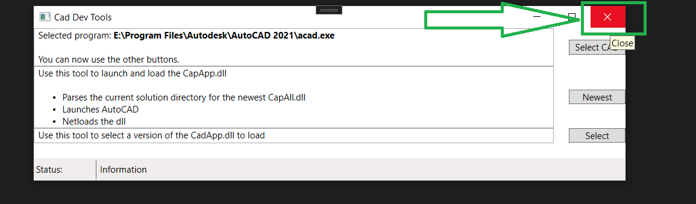

# cadwiki nuget examples
A collection of sample projects and solutions to demonstrate how to use cadwiki nuget packages

## App.sln  
This is a AutoCAD IExtensionApplication written in vb.net.  
It demonstates how to use the cadwiki.DllReloader to easily reload itself into a AutoCAD's current Application Domain.  
The cadwiki.DllReloader makes seeing code changes in AutoCAD faster since you won't have to close and restart for each new dll build.  

### Before Building
Repath the interop references on the AcadInterop2021 project

Autodesk.AutoCAD.Interop
Autodesk.AutoCAD.Interop.Common

This is probably where they are on standard installations of AutoCAD.
If you installed to a custom drive (example 'E:\' instead of 'C:\') then repath to the custom path instead
C:\Program Files\Autodesk\AutoCAD 2021\Autodesk.AutoCAD.Interop.dll
C:\Program Files\Autodesk\AutoCAD 2021\Autodesk.AutoCAD.Interop.Common.dll

### Build steps
Click Build -> Rebuild solution in Visual Studio

During the build, the .vbproj files will:
1. update all AssemblyInfo.vb files based on the buildThisFirst projects mblyInfo.vb file
1. create all .dlls
1. copy all .dlls into the .\MainApp\bin\v_#.#.#.# folder that corresponds to the current build number.  
1. create a bootload.scr file for netloading the new .dll into AutoCAD

### Automated Debug steps

Click Build -> Rebuild solution in Visual Studio.  
This is done to ensure all the .dll's are ready for the CadDevTools project.  
   

Set startup project as CadDevTools.  
  

Click Green Start button on top middle menu of Visual Studio.  
  

The CadDevTools UserInterface will start.  
  

On the Right Side, Click 'Select CAD'.  
  

The box will be populated with a few locations of AutoCAD.  
Choose an existing location or 'Browse' to a new location. 
  

Click Green Okay.  
  

On CadDevTools screen, Click 'Newest'.
    

This will load the most recently built .dll in the _v subfolder of the current .exe's bin folder.  
AutoCAD will start and netload the dll for you.

### How to reload a .dll  
Make sure AutoCAD is running with the dll netloaded.  
Close CADDevTools UserInterface if it's open.  
  

Detach Visual Studio.  

Rebuild MainApp project.  
  

In AutoCAD, Click 'Reload Count:#'  
    

The dll will be Reloaded with your new changes  
   

You can now reattach the debugger to AutoCAD to debug the Reloaded .dll  
  

### Manual Debug steps
Set startup project as MainApp
Goto MainApp->Properties->Debug

Set Startup program:
C:\Program Files\Autodesk\AutoCAD 2021\acad.exe

Set Command line arguments to the bootload.scr created from the build process:
/b "C:\..someWhere...\pathToRepoRoot\bootload.scr"

Click Green Start button on top middle menu of Visual Studio  